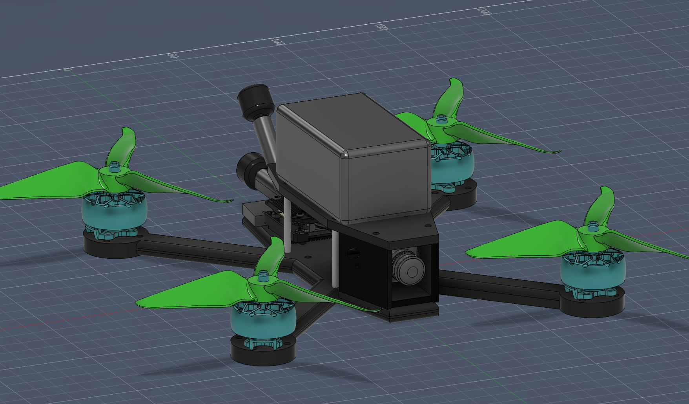
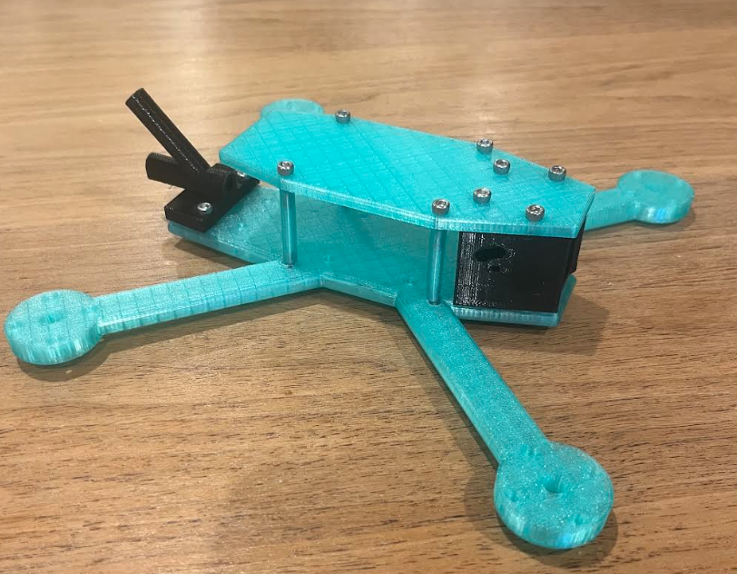

# AeroVison-Drone
A drone with a camera that connects to drone goggles to fly in first person view. 3d printed and custom frame. All parts were researched and chosen to not be too expensive, but still high quality. Sub $1000.

Assembly with battery on top. 

### Why a Drone?
Every since my brother and I got a 3d printed a few years ago, we have wanted to design a drone, and 3d print the frame of it. But, we have never actually got around to doing it, either because we were busy, lazy, or didn't think that we could fund it. But, it was always still in our minds (at least my mind). Making a drone sounded really cool and fun, even though me personally, I didn't know anything about them, how they worked, or how expensive they would be, other than that I assumed that it would cost A LOT to make, which kind of discouraged me. 

## Starting the Project
Just like I mentioned before, I always wanted to make/have a drone, so the idea of making one was very exciting. The reason that I actually started though, was because my dad said that if I design a custom frame, and did all of the work doing all of the parts of designing the drone, he would fund the project for me. I instantly started to research every part of the drone. But, the first thing I did was start with a brainstorming session to get a few guidelines, and base things that needed to be achieved. These were the original guidelines:
 - Low-ish Cost but High Quality (sub $1000)
 - 3d Printed Frame
 - Live Feed Camera with Drone Goggles
 - 100ft Minimum flight height
 - Being Able to have the drone do a flip
 - Be able to survive crashes (I am a beginner, and I know I will crash a few times)

Most of these are basic things that all drones can do, but the one thing (other than a 3d printed frame) that isn't always found is the drone goggles with a live feed camera. This was one baseline that my dad really wanted out of this drone. Because he is funding the project, I can't argue (and I really wanted that too, so I would argue anyways). I knew that this would dramatically increase the price of this projects, but that's ok.

### Process of Designing a Drone
During research, I learned this process that is used when first starting to design a drone,
1. Choose Frame size
2. Choose Propeller Size (which kind of is chosen with the frame size)
3. Choose Motor Size
4. Choose Battery Voltage

The first thing that I did was find out what size I wanted the drone to be. I researched how big drones are that can fly outside, fast, and won't get blown away hard in the wind. I decided to choose a 5 inch drone (which means the propellers are 5 inch, not the actual frame). This completed the first two steps in the process, which means I needed to find a motor size, and then the battery voltage. 

When choosing the motor size, you have to account for the size of your frame and propellers, because the strength of the motor is in a direct relationship with those. The bigger your frame, the more weight you have to propel, and you need to make sure that the motors fit your propellers, and are strong enough to be used for a 5 inch frame. An additional requirement that I had was to make all of things crash resistant, so I needed a good motor that wouldn't break. I found one that could withstand high voltage, had a steel shaft so it wouldn't break in a crash, and is relatively cheap. 

Based on the size and voltage needed for my motors, that is how I chose my battery. I decided that I needed a 6s battery so there would be enough power to have good flight times, and propel the drone powerfully. Alos, the battery I chose weighed a little more, but that is because I needed it to be able to withstand crashes (per my requirements). 

### Parts Analysis
All of the "big" parts that I have chosen for this drone, I have done an analysis to find the best one that fits this project the best based on it's cost, performance, advantages, disadvantages etc. You can find these analyses in the "Part Analysis-Comparison" folder. These are the main parts the I did an analysis on:
 - Camera and VTX
 - Controllers and Receivers
 - 6s Batteries
 - Filament (When to use which filament)
 - FC+ESC Stack
These are some of the big components for the drone that I decided needed to be really well thought out. The only other big thing that I didn't do an analysis for, was the goggles, because they were the only relatively low cost goggles that still had good camera options.

### Stack
For this build, you can use two different stack options, including the speedybee V4, and speedybee V5. This was designed to accommodate either stack, and there is a wiring diagram for both as well. In the BOM, there is only the V4, because it is cheaper to buy that, but the other one works as well. Some reasons to be able to switch between them, are shipping times, quality, and if you have any personal preference. Either one works great!

# Build Instructions
- **Order All of the Necessary Parts**
Go through the BOM and buy all of the parts on the list. Tip: try to get the controller as soon as possible, so you can start practicing on an online simulator. For the 3d printed parts, I would first 3d print all of the parts in a prototype material (pla/petg) and make sure that all of the electronics fit. This also helps you know if there are any problems before printing with a more expensive filament, and it gives you build experience!

- **Assemble the Frame (prototype)**
For the frame, there are a few thing that you will need. The base plate, the standoffs, the top plate, and the mounting pieces for the camera and antenna. You will assemble the frame first with the prototype material 3d print, to make sure that everything works well. You can also mount all of the electronics if you want, also to make sure the spacing is correct. It all should be fine, but case by case it might be different, and you don't want any problems to occur.

- **Wiring**
This is the hardest part of the whole project. You will need to follow the wiring diagram below to make sure that everything is wired correctly.

To explain the wiring diagram (speedybee V4), the four motors are soldered onto the esc (the bottom of the stack) as well as the cord that connects to the battery, and the capacitor (little cylinder like thing). The order of the motor wires doesn't matter, but for the red and black big wire, the red goes to the positive side, and the black on the negative. The capacitor is the same way. Then, the esc, and fc are connected with a wire provided in the stack kit, and the fc will be on the top. There are two main things that connect to the FC, the receiver, and the VTX. The receiver is connected on the specific soldering pods as shown below, but in the patter of (-,gnd)(5V,4V5)(TX,R2)(RX,T2). The VTX is the other part that connects to the receiver, but there is no welding required for this one. On the side of the stack (the one shown in the diagram), there is a wire plug port for a 6 pin wire, which you plug in, then you plug in the other end into the VTX. For this specific design, you have to use a 4 pin to 6 pin wire, because the VTX only has a 4 pin option, and the stack only has a 6 pin, but thankfully, there are wires (in the BOM to account for this). Then, the camera and antennas connect to the vtx in their specific ports as shown in the image.

For the V5 option, the wiring is the same, just different places on the stack. Review the diagram while soldering to make sure you are using the same ports. This image better shows that ports for the 6 pin wire that connects to the VTX, because it has the top and bottom of the FC. The top part connects to the receiver, and the bottom one connects to the esc, and the VTX. 

While wiring, it is very important that you first screw everything into place (motors, vtx, camera, stack) and mark on the wires where you need to cut them to be the proper length for your specific drone. You want to cut it a little longer than you expect, because a little extra wire isn't bad, and if you mess up, you can then cut the wire again to fix it (to the proper size). After you mark where they need to be cut, you actually need to take off the electronics, so you can actually wire them together. This starts with the motors that you will need to weld onto the esc (review the diagram), then you need to weld on the receiver (also the diagram), and then you put the stack on top of each other, and plug those together. Then, you screw back in all of the electronics, making sure that you have the right motors in the right spots (because you cut the wires to that specific length), and your stack in the right direction. After you have screwed in the VTX, antennas, and camera, you thread the camera wire through the middle of the stack, and plug that into the vtx. Then you plug in the two antennas to the VTX, and finally plug the VTX into the FC. When you plug in the battery, make sure to use the smoke stopper first, so if you messed up on your welds, it won't fry your system. Very important. 

For this part, you will screw down and measure based off of the Nylon-cf frame (the real thing, not prototype) and screw down all of the electronics/motors there. You only need to use the base of the frame, at this point don't worry about the standoffs or the top piece.

- **Assemble the Frame Part 2 (The real deal)**
Now that you have all of the wiring done, and the electronics all screwed into the right places, you need to add the standoffs, and the top plate. You will screw M3 screws from the top plate down into the standoff, and from the main frame body up into the standoffs. The standoffs are threaded, so you don't have to worry about bolts. 

- **Tape the wires down**
Now that you have all of the wires and electronics in the right place, you need to tape them down. This is to protect them, and to keep the from wiggling. The main place you will tape is the X arms, where the wires connecting to the motors are, so those are protected during a crash. you might think that it is weird that the receiver is not screwed in anywhere, and if you can't find a place to tuck that in, you can tape that down as well. All of the other wires will probably be fine to not tape down, but it is a case by case thing.

- **The Battery**
There is more than just adding the battery when you are talking about this drone. You will first (as I mentioned above) use the smoke stopper when you plug in, to make sure that it is fine. If you hear two seperate beeps, then you are all set, and you can remove the smoke stopper, and re-plug it in. If you don't, then there is a problem with the soldering, and you will have to review it. Then, you will need to attach your battery pad onto the top plate. It is pretty big, so you will first have to trim it to the size of your top plate, then stick it on. When you go to fly, you will have to put the battery onto that top plate, then you have to strap the battery in, with the battery straps. You need to order two of these, so that you can strap it down on both sides of the battery. You can either strap it around only the top plate, or both the top and bottom plate. Your choice.

- **Software configuration**
Now go into Betaflight, and configure it how you want to fly it. You need to calibrate the sensors, test the motor direction to make sure they are the right way. This is all personal preference, so you can configure it how you want. I have not done this yet (because I haven't built it yet), and I will record what I did after I do it myself.

- **Final Add On**
Add on the propellers and double check that each screw is put on correctly. If you want you can add lock tight to the screws so they don't unscrew. That is totally optional though. Make sure to add both of the battery straps each time you fly. Now you are ready to fly FPV!!

# Wiring Diagram (SpeedyBee V4)

# Wiring Diagram (SpeedyBee V5)

### Original Planning Whiteboard
This isn't really necessary, but here is an image of the original planning whiteboard that I used to first start this project. 

### Camera Mount/Antenna Holder/Main Frame
The parts that I specifically designed were the camera mount, antenna holder, and the mainframe. The assembly is made up of these parts, and a compilation of other parts that I found online for free, such as the motors, camera, vtx, and the actual antennas. I did put together all of the parts of the drone assembly, but the parts that I actually designed were these ones. 

## Example of 3d Printed Frame
So, I am still in the design, and buying parts phase of this project, but I 3d printed an example frame to show myself about the size of the drone, and to make sure the screw holes were right. For this edition, I 3d printed it out of PETG translucent, and low infill and 2 wall loops, just because this is a prototype, and not meant to actually fly. It still holds the same concept of the size and shape of drone, and is the same design that I will print later, just not as much filament. 

I printed the standoffs, even though in the actual thing they will be aluminum, but I attached the top and bottom plate, as well as the camera mount, and the antenna mount, which I printed out of tpu. I screwed them all together, and this is what I got.  

# BOM 
| Item (General Name)      | Actual Name                                                                                                                                                                                       | Unit Price | Quantity        | Total Price | URL                                                                                                                                                                                                                                                                                                                                                                                                                                                                                                                                                                                                                                                                                                                                   |
|--------------------------|---------------------------------------------------------------------------------------------------------------------------------------------------------------------------------------------------|------------|-----------------|-------------|---------------------------------------------------------------------------------------------------------------------------------------------------------------------------------------------------------------------------------------------------------------------------------------------------------------------------------------------------------------------------------------------------------------------------------------------------------------------------------------------------------------------------------------------------------------------------------------------------------------------------------------------------------------------------------------------------------------------------------------|
| Drone Goggles            | Walksnail Avatar HD Goggles L Only                                                                                                                                                                | $199.99    | 1               | $199.99     | https://www.caddxfpv.com/products/walksnail-avatar-hd-goggles-l-only                                                                                                                                                                                                                                                                                                                                                                                                                                                                                                                                                                                                                                                                  |
| Camera/Antena/VTX        | Walksnail Avatar HD Pro Kit (Dual)                                                                                                                                                                | $169.00    | 1               | $169.00     | https://www.caddxfpv.com/products/walksnail-avatar-hd-pro-kit-dual-antenna                                                                                                                                                                                                                                                                                                                                                                                                                                                                                                                                                                                                                                                            |
| 4 Propellers             | HQ Prop Ethix S5 Light Grey (2CW+2CCW)-Poly Carbonate                                                                                                                                             | $3.49      | 3               | $10.47      | https://www.readymaderc.com/products/details/hq-prop-ethix-s5-cinematic-propeller?srsltid=AfmBOoqpS3iFBhneicRLO4TDucw7YhVlbW31C4zBvQTBZfkv_Lk7zFUf                                                                                                                                                                                                                                                                                                                                                                                                                                                                                                                                                                                    |
| 4 Motors                 | XING2 2207 1855KV 3-6S / 2755KV 3-5S Brushless FPV Motor for IFlight with 5mm Titanium Alloy Shaft for 5.1inch Propeller RC FPV Drones (4pcs 2207 1855kv)                                         | $77.30     | 1               | $77.30      | https://www.amazon.com/Brushless-IFlight-Titanium-5-1inch-Propeller/dp/B0DG8QN6KY?th=1                                                                                                                                                                                                                                                                                                                                                                                                                                                                                                                                                                                                                                                |
| FC+ESC Stack             | Speedybee F405 V4 Stack BLS 55A 4-in-1 ESC&FC RC iNAV Betaflight Configure Bluetooth 3-6S FPV 5-8 inch frame Drone parts                                                                          | $68.33     | 1               | $68.33      | https://www.aliexpress.us/item/3256808521625736.html?src=google&gatewayAdapt=glo2usa                                                                                                                                                                                                                                                                                                                                                                                                                                                                                                                                                                                                                                                  |
| .5 Kg Nylon-CF           | Fiberon™ PA6-CF20                                                                                                                                                                                 | $39.99     | 0 (already own) | 0           | https://shop.polymaker.com/products/fiberon-pa6-cf20?variant=43596329287737&country=US&currency=USD&utm_medium=product_sync&utm_source=google&utm_content=sag_organic&utm_campaign=sag_organic&srsltid=AfmBOooEZCT3cZew6KhSpcgE2PYBhO1RJA13VqBT6cZQ7D1P8CfT1LHNWk4                                                                                                                                                                                                                                                                                                                                                                                                                                                                    |
| .75 Kg of TPU            | PolyFlex™ TPU95                                                                                                                                                                                   | $29.99     | 0 (already own) | 0           | https://shop.polymaker.com/products/polyflex-tpu95?srsltid=AfmBOooIXCCPv5QnSXqfcX7JN4BNmuMQ1Yl41v6gLJdskUztjPoAhvwX&variant=39574341681209                                                                                                                                                                                                                                                                                                                                                                                                                                                                                                                                                                                            |
| Controller               | Pocket Radio Controller (M2)                                                                                                                                                                      | $71.50     | 1               | $71.50      | https://radiomasterrc.com/products/pocket-radio-controller-m2                                                                                                                                                                                                                                                                                                                                                                                                                                                                                                                                                                                                                                                                         |
| Reciever                 | RP1 V2 ExpressLRS 2.4ghz Nano Receiver                                                                                                                                                            | $18.99     | 1               | $18.99      | https://radiomasterrc.com/products/rp1-expresslrs-2-4ghz-nano-receiver                                                                                                                                                                                                                                                                                                                                                                                                                                                                                                                                                                                                                                                                |
| Battery x4               | Ovonic 6S 1300mAh 100C 22.2V LiPo Battery with XT60 Plug for 5-6 Inch FPV Freestyle Drone                                                                                                         | $59.99     | 1               | $59.99      | https://us.ovonicshop.com/products/ovonic-100c-1300mah-6s1p-22-2v-xt60-4pcs-lipo-battery?variant=51020794462488                                                                                                                                                                                                                                                                                                                                                                                                                                                                                                                                                                                                                       |
| Battery Strap            | Kevlar Fly High FPV Lipo Strap for 5"" quads 250mm                                                                                                                                                | $5.00      | 2               | $10.00      | https://flyhighfpv.com/products/kevlar-lipo-straps?variant=42428394307773&country=US&currency=USD&utm_medium=product_sync&utm_source=google&utm_content=sag_organic&utm_campaign=sag_organic&srsltid=AfmBOoozHgXdM-2HsTUz3gc6ptbjEY6biMFLwh__Q4-PYUZQDaH1XgXkZz4                                                                                                                                                                                                                                                                                                                                                                                                                                                                      |
| Batteries for Controller | Molicel M35A 18650 3500mAh 10A Battery                                                                                                                                                            | $6.99      | 2               | $13.98      | https://18650battery.com/products/molicel-m35a-18650-3500mah-10a-battery?variant=48752348758326&country=US&currency=USD&utm_medium=product_sync&utm_source=google&utm_content=sag_organic&utm_campaign=sag_organic&srsltid=AfmBOorZv8jdqPARdFKoxa6n8cFLQjbUeAm_l-Q1zIckt1snm_xNVyaNk-c                                                                                                                                                                                                                                                                                                                                                                                                                                                |
| Battery Charger          | 608 AC Lipo Battery Charger,AC 50W/DC 200W Dual Mode RC Discharger/Charger                                                                                                                        | $64.99     | 1               | $64.99      | https://isdtshop.com/products/isdt-608ac                                                                                                                                                                                                                                                                                                                                                                                                                                                                                                                                                                                                                                                                                              |
| Standoffs                | M3 Knurled Aluminum Standoff - 5Pcs.                                                                                                                                                              | $3.99      | 1               | $3.99       | https://pyrodrone.com/products/textured-aluminum-stand-off?variant=11572558594091&country=US&currency=USD&utm_medium=product_sync&utm_source=google&utm_content=sag_organic&utm_campaign=sag_organic&srsltid=AfmBOooPTPHT5g5ZQUPyy9x4DjfrEw1lCkZYxO78QHLouVfFCtrbZha1y6o                                                                                                                                                                                                                                                                                                                                                                                                                                                              |
| Solder                   | Rosin Core Solder 60/40 (1/2 oz)                                                                                                                                                                  | $1.40      | 1               | $1.40       | https://kingcobrahobby.com/products/miniatronics?currency=USD&country=US&variant=43144886255846&utm_source=google&utm_medium=cpc&utm_campaign=Google%20Shopping&stkn=ea97c4e6667c                                                                                                                                                                                                                                                                                                                                                                                                                                                                                                                                                     |
| Soldering Flux           | No Clean Solder Paste Flux, 10g/50g Semi-Solid Soldering Paste for Electronics, Strong Welding Power for Circuit Board Repair and Electrical Soldering，10g                                        | $0.79      | 1               | $0.79       | https://www.walmart.com/ip/No-Clean-Solder-Paste-Flux-10g-50g-Semi-Solid-Soldering-Electronics-Strong-Welding-Power-Circuit-Board-Repair-Electrical-Soldering-10g/20183100379?wmlspartner=wlpa&selectedSellerId=102533708&veh=seo_fpl&cn=google                                                                                                                                                                                                                                                                                                                                                                                                                                                                                       |
| M2 Screws                | 1110 Pcs M2 Screws Kit, M2 Machine Screws and Nuts and Washers Set, Assorted Stainless Steel Button Head Socket Cap Screws Nuts and Bolts Assortment Kit, Metric Screw Assortment, Fully Threaded | $7.99      | 1               | $7.99       | https://www.amazon.com/Machine-Assorted-Stainless-Assortment-Threaded/dp/B0DFWXRM21/ref=sr_1_6?crid=1GXVALRONUM18&dib=eyJ2IjoiMSJ9.9MKH52xEgkhvxWvrcwomxN83eqYR-qU1F_Ja9XeYUG_Xism4gona_L3lOORlTWuQV_0NYz9kzVXQRMQNuIvg9L3Ok4CKaVRWlKhzjjyD8KcYZPMCHJ54dHmyFaUykZggFGT4SMHoULPzlX8EcnHD8_BY1scuwf4iq_WVMVKIXz9KvVK6VUXLglkPos-ZsyXA3Dobc_6AA_4q-X1QwZ9Je1rUK7Rn0CP7YHXzDXsf_7U.h3IKDORbn6Y323_xNZh6MqikQcMu27PtbVfCpaStzWw&dib_tag=se&keywords=m2%2Bscrews%2Bkit&qid=1786056041&sprefix=m2%2Bscrews%2Bki%2Caps%2C199&sr=8-6&th=1                                                                                                                                                                                                      |
| M3 Screw                 | 22 (9mm)   This kit has everything you will need.                                                                                                                                                 | $9.99      | 0 (already own) | $0.00       | https://www.amazon.com/Fgruh-750PCS-Assortment-Washers-Assorted/dp/B0FGV5FCBN/ref=sr_1_1_sspa?dib=eyJ2IjoiMSJ9.cPekTjkEYdRojQiPp36UKxqAViaYHg5gpFhvGb9vVmgRTZ7zPrv3HTeB06e-VuRSe35XU5I3bJ4X8FVqyLkdsUP_JjbRtJ9zYBwwIAWMxVUyO5zFMhYjLjAaJArrVvw8MZdkURHXdJ0CnYPgB1PGOfBEOSj-d_2Cl4qOGnYwSBIaSITUQTbJPL3qzYJ8bEp8vuiqfOJ5srvQYxwkrrBs5Qwi1Ov6NL-W-LeVlo_G0MA.uRsazJbvwNeUAl4nvOGAoA_cDQMtObw39Mqt9p1BFWk&dib_tag=se&hvadid=694496494502&hvdev=c&hvexpln=67&hvlocphy=9029746&hvnetw=g&hvocijid=10495880964745057321--&hvqmt=e&hvrand=10495880964745057321&hvtargid=kwd-336502747652&hydadcr=289_1015151249&keywords=m3+screws+kit&mcid=bae9efb87b0337498e99803211597c4f&qid=1786055672&sr=8-1-spons&sp_csd=d2lkZ2V0TmFtZT1zcF9hdGY&psc=1 |
| Battery Pad              | Ummagrip Battery Pad - TBS Edition                                                                                                                                                                | $4.99      | 1               | $4.99       | https://www.team-blacksheep.com/products/prod:ummag_tbsedition?srsltid=AfmBOoqnrBrm0EfL2f8LfQvsgv3h7cxKNtvhawZJBrjYnoVQ6Q2B3T42drU                                                                                                                                                                                                                                                                                                                                                                                                                                                                                                                                                                                                    |
| 4 to 6 pin wire          | Walksnail VTX Connecting FC Cable                                                                                                                                                                 | $2.99      | 1               | $2.99       | https://www.caddxfpv.com/products/walksnail-vtx-connecting-fc-cable                                                                                                                                                                                                                                                                                                                                                                                                                                                                                                                                                                                                                                                                   |
| Smoke Stopper            | JHEMCU Smoke Stopper 1-6S XT60 / XT30 Resettable In-Line Fuse Short Circuit Protection                                                                                                            | $4.99      | 1               | $4.99       | https://speedyfpv.com/products/jhemcu-rc-smoke-stopper?variant=44895842533590&country=US&currency=USD&utm_medium=product_sync&utm_source=google&utm_content=sag_organic&utm_campaign=sag_organic&srsltid=AfmBOopXqfHqlgRT92eYcT7In0hEbdKI5Wk4CQXIehU2209j-tDrPTdHX6U                                                                                                                                                                                                                                                                                                                                                                                                                                                                  |

## Understanding CAD Files
I have a method the I used that I think is organized, but I am putting a guide, just so it is easy to know where to find any files. All of the CAD files will be found in the CAD folder, and there are a few images of the CAD in the images folder. This is how it is organized

Folders:
- Assembly (All parts included, finished design, .step and .f3d)
- Main Frame (Only the base frame and the top plate with standoffs connecting them, .step and .f3d)

Individual Files (.step)
- Antenna Holder 
- Camera Mount 
- Motors
- Propellers
- Camera + VTX + Antenna

I don't have a stack model, but the dimension are accurate to the real thing. Don't worry. Also, I have .step files for all of the little things like mounts, and I added .f3d files for the bigger things like the assembly, and the mainframe. I hope this helps. 

### Overview and License
This project has taught me a lot about electronics, and how wiring works. I am improving on my CAD (which isn't very good), and had been a good opportunity for me to start learning new CAD skills, and skills pertaining to drones in general. I used the MIT Licence. 

