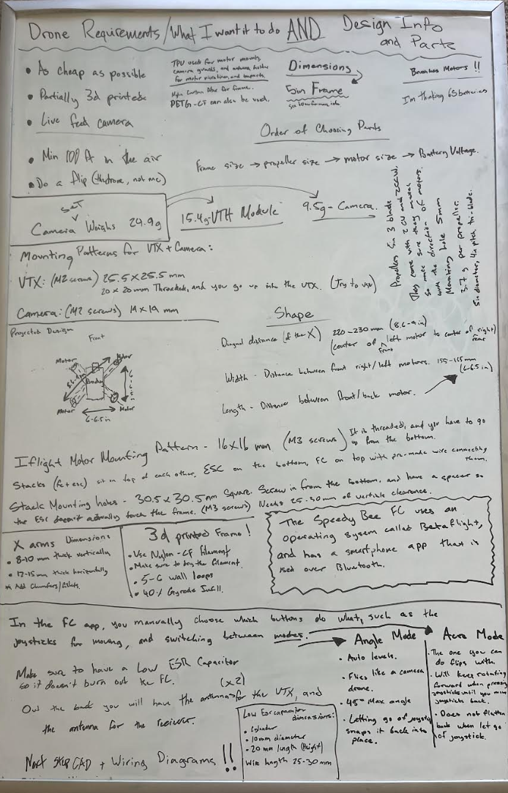

# AeroVison-Drone
A drone with a camera that connects to drone goggles to fly in first person view. 3d printed and custom frame. All parts were researched and chosen to not be too expensive, but still high quality. Sub $1000.

### Why a Drone?
Every since my brother and I got a 3d printed a few years ago, we have wanted to design a drone, and 3d print the frame of it. But, we have never actually got around to doing it, either because we were busy, lazy, or didn't think that we could fund it. But, it was always still in our minds (at least my mind). Making a drone sounded really cool and fun, even though me personally, I didn't know anything about them, how they worked, or how expensive they would be, other than that I assumed that it would cost A LOT to make, which kind of discouraged me. 

## Starting the Project
Just like I mentioned before, I always wanted to make/have a drone, so the idea of making one was very exciting. The reason that I actually started though, was because my dad said that if I design a custom frame, and did all of the work doing all of the parts of designing the drone, he would fund the project for me. I instantly started to research every part of the drone. But, the first thing I did was start with a brainstorming session to get a few guidelines, and base things that needed to be achieved. These were the original guidelines:
 - Low-ish Cost but High Quality (sub $1000)
 - 3d Printed Frame
 - Live Feed Camera with Drone Goggles
 - 100ft Minimum flight height
 - Being Able to have the drone do a flip
 - Be able to survive crashes (I am a beginner, and I know I will crash a few times)

Most of these are basic things that all drones can do, but the one thing (other than a 3d printed frame) that isn't always found is the drone goggles with a live feed camera. This was one baseline that my dad really wanted out of this drone. Because he is funding the project, I can't argue (and I really wanted that too, so I would argue anyways). I knew that this would dramatically increase the price of this projects, but that's ok.

### Process of Designing a Drone
During research, I learned this process that is used when first starting to design a drone,
1. Choose Frame size
2. Choose Propeller Size (which kind of is chosen with the frame size)
3. Choose Motor Size
4. Choose Battery Voltage

The first thing that I did was find out what size I wanted the drone to be. I researched how big drones are that can fly outside, fast, and won't get blown away hard in the wind. I decided to choose a 5 inch drone (which means the propellers are 5 inch, not the actual frame). This completed the first two steps in the process, which means I needed to find a motor size, and then the battery voltage. 

When choosing the motor size, you have to account for the size of your frame and propellers, because the strength of the motor is in a direct relationship with those. The bigger your frame, the more weight you have to propel, and you need to make sure that the motors fit your propellers, and are strong enough to be used for a 5 inch frame. An additional requirement that I had was to make all of things crash resistant, so I needed a good motor that wouldn't break. I found one that could withstand high voltage, had a steel shaft so it wouldn't break in a crash, and is relatively cheap. 

Based on the size and voltage needed for my motors, that is how I chose my battery. I decided that I needed a 6s battery so there would be enough power to have good flight times, and propel the drone powerfully. Alos, the battery I chose weighed a little more, but that is because I needed it to be able to withstand crashes (per my requirements). 

### Parts Analysis
All of the "big" parts that I have chosen for this drone, I have done an analysis to find the best one that fits this project the best based on it's cost, performance, advantages, disadvantages etc. You can find these analyses in the "Part Analysis-Comparison" folder. These are the main parts the I did an analysis on:
 - Camera and VTX
 - Controllers and Receivers
 - 6s Batteries
 - Filament (When to use which filament)
 - FC+ESC Stack
These are some of the big components for the drone that I decided needed to be really well thought out. The only other big thing that I didn't do an analysis for, was the goggles, because they were the only relatively low cost goggles that still had good camera options.

# Build Instructions
- **Order All of the Necessary Parts**
Go through the BOM and buy all of the parts on the list. I would try to buy the controller first (just trust me, I will explain later) so it arrives first. For the 3d printed parts, 3d print them yourself, or have somebody print them for you.
- **Assemble the Frame**
I will have different parts that I will have to add onto the main frame of the drone. Fore example there will be motor guards and a camera guard. Also, it is good to first fully assemble the frame with all of the standoffs first, just so you can know what it will look like, then disassemble it.
- **Electronics Installation**
Put all of the electronics into the spots that they are going to be on the final build. Line up the wires according to the wiring diagram (Found in images). Screw in each part, and make sure that each wire is lined up with the correct port.
- **Soldering**
Now you have to cut all of the wires to the length needed to be soldered onto the FC/ESC. You also need to make sure that the wires aren't too tight or too loose, and do good soldering. This is probably the hardest part of the whole entire build. Make sure that you follow the wiring diagram.
- **Tape/Zip tie the wires down**
To protect the wires from moving, and during crashes, tape around all of the wires (especially the ones on the arms, and make sure they are covered. You can also zip tie the wires down as well, but they might be a little less protected in a crash that way. 
- **Software configuration**
Now go into Betaflight, and configure it how you want to fly it. You need to calibrate the sensors, test the motor direction to make sure they are the right way.
- **Final Add On**
Add on the propellers and double check that each screw is put on correctly. Now you are ready to fly FPV!!

### Original Planning Whiteboard
This isn't really necessary, but here is an image of the original planning whiteboard that I used to first start this project. 

### Camera Mount/Antenna Holder/Main Frame
The parts that I specifically designed were the camera mount, antenna holder, and the mainframe. The assembly is made up of these parts, and a compilation of other parts that I found online for free, such as the motors, camera, vtx, and the actual antennas. I did put together all of the parts of the drone assembly, but the parts that I actually designed were these ones. 

## Example of 3d Printed Frame
So, I am still in the design, and buying parts phase of this project, but I 3d printed an example frame to show myself about the size of the drone, and to make sure the screw holes were right. For this edition, I 3d printed it out of PETG translucent, and low infill and 2 wall loops, just because this is a prototype, and not meant to actually fly. It still holds the same concept of the size and shape of drone, and is the same design that I will print later, just not as much filament. 

This is only the base frame, not the top plate, or the standoffs. 

.png)

## Understanding CAD Files
I have a method the I used that I think is organized, but I am putting a guide, just so it is easy to know where to find any files. All of the CAD files will be found in the CAD folder, and there are a few images of the CAD in the images folder. This is how it is organized

Folders:
- Assembly (All parts included, finished design, .step and .f3d)
- Main Frame (Only the base frame and the top plate with standoffs connecting them, .step and .f3d)

Individual Files (.step)
- Antenna Holder 
- Camera Mount 
- Motors
- Propellers
- Camera + VTX + Antenna

I don't have a stack model, but the dimension are accurate to the real thing. Don't worry. Also, I have .step files for all of the little things like mounts, and I added .f3d files for the bigger things like the assembly, and the mainframe. I hope this helps. 

### Overview and License
This project has taught me a lot about electronics, and how wiring works. I am improving on my CAD (which isn't very good), and had been a good opportunity for me to start learning new CAD skills, and skills pertaining to drones in general. I used the MIT Licence. 

